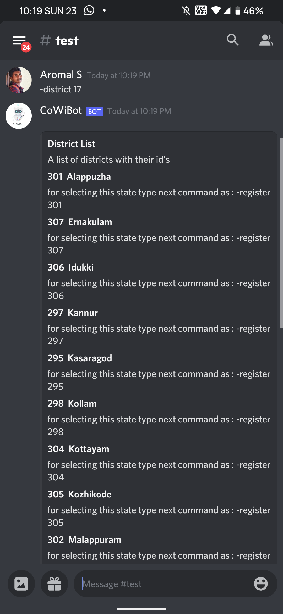

# [CoWibot](https://discord.com/api/oauth2/authorize?client_id=843349115609415701&permissions=2148005952&scope=bot) 

[Click Here To Add Bot To Your Server](https://discord.com/api/oauth2/authorize?client_id=843349115609415701&permissions=2148005952&scope=bot)
## Team members
**1.** [*Aromal S*](https://github.com/aromalsanthosh)<br>
**2.** [*Noel Jose TP*](https://github.com/noel-jose)<br>
**3.** [*Akhil S Unni*](https://github.com/AKHILSUNNI)<br>
## Team Id
***BFH/reci7s2lmmQkZbNS8/2021***
## Requirements

1. Discord Bot Token **[Guide](https://discordjs.guide/preparations/setting-up-a-bot-application.html#creating-your-bot)**

2. Node.js v12.0.0 or newer

## 🚀 Getting Started

If deploying to Heroku make sure to create config variables
```
git clone https://github.com/The-Megabytes/CoWiBot.git
cd CoWiBot
npm install
```
## How to Use
**Commands**
This bot has many many commands. Here are a few highlights:

- `-help` -> Lists all commands and info about command usage.
- `link` -> Returns Link to official [CoWin website](https://www.cowin.gov.in/home).
- `-ping` -> Check if bot is working
- `-states` -> Display list of states and state ID to choose from. Inorder to select a state and list the districts **use** :``-district <state id>``
- `-district <state id>` -> Displays link of districts in the state selected .In order to select a district **use**: `-register <district id>`
- `-register <district id` => Displays whether vaccine slots are available, If available link to vaccine portal is given
- `-reminder <district id>` -> Initially checks if slots are available, If not available, the bot notifies you at hourly intervals until a slot is available
## Screenshots

<div float="left">
    
    
    
    
</div>

<div float="left">
    
    
    
</div>

## How it Works ?
 -Working of project [Youtube Video Click Here](https://youtu.be/z8hMozfA5QU)

## Libraries used

-   Node.js - 14.17.0
-   Discord.js - 12.5.3
